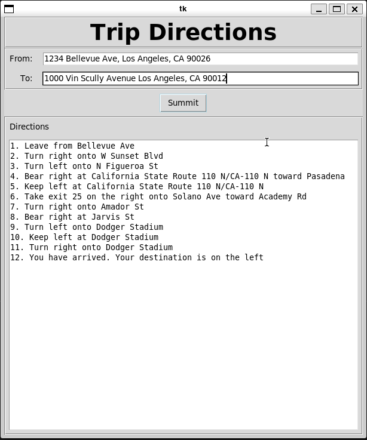

# Directions App

The Directions app takes an origin address ("From") and a destination address ("To") and provides turn-by-turn directions. The app is powered by [TomTom](https://www.tomtom.com/) Maps.



## Running the App

### Requirements

1. [Python](https://www.python.org/downloads/release/python-3120/) v3.12+
2. [tkinter](https://docs.python.org/3/library/tkinter.html)
3. [TomTom](https://www.tomtom.com/) Maps API key

### Python Setup

It is highly recommended to create a virtual environment to run the app. You can do so by running:

```
python -m venv venv  # wait for the environment to be created
```

```
. venv/bin/activate  # activate the environment
```

From the root of the project, install the required Python modules by running:

```
pip install -r requirements.txt
```

### Verify tkinter is Installed

Verify that [tkinter](https://docs.python.org/3/library/tkinter.html) is installed. You can run the command below to check. If it is not installed, follow the instructions on the [tkinter](https://docs.python.org/3/library/tkinter.html) website for your operating system.

```
python -m tkinter
```

### Getting a TomTom API Key

Visit the [TomTom Maps website](https://www.tomtom.com/), create a developer account, and generate an API key. Make sure to review their terms of service.

Once you have your API key, create an environment variable named `TOMTOM_API_KEY`. This will ensure your requests are authenticated. Refer to your OS documentation for how to set an environment variable. Here's an example for Linux:

```
export TOMTOM_API_KEY="your_api_key_here"
```

### Running the App

Once all requirements are fulfilled, you can run the application by executing:

```
python main.py
```
